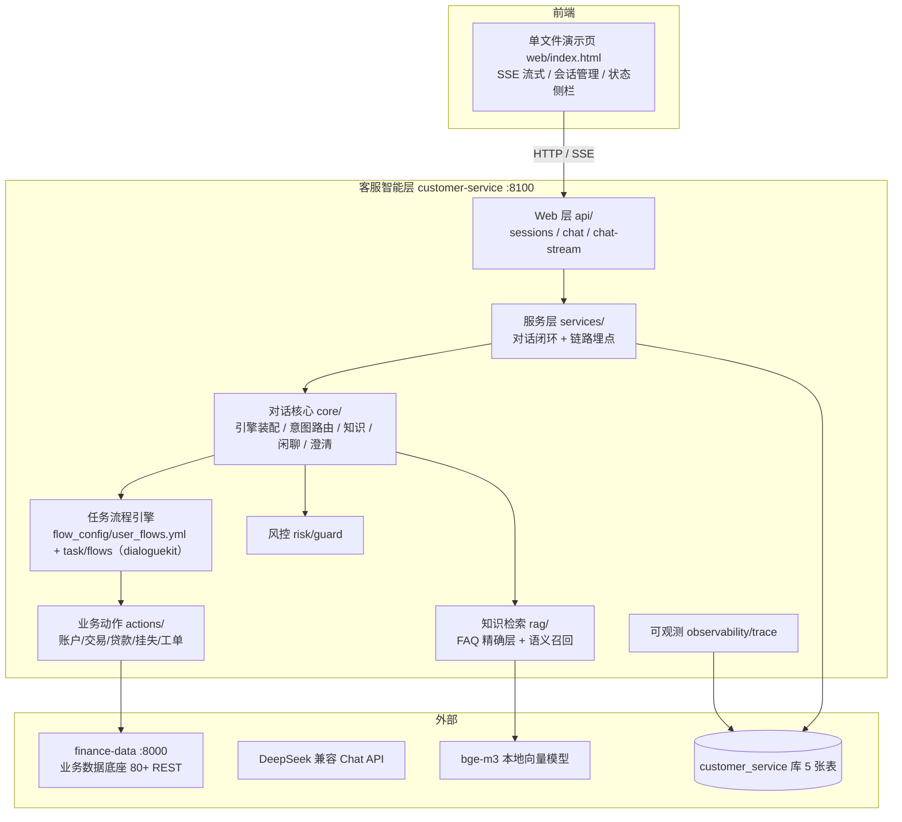

# 金融智能客服系统 · 架构说明

> 适用版本：`main`（提交 243f756）
> 定位：面向金融行业（中州银行样例场景）的智能客服系统，对标“用户提问 → 意图识别 → 业务查询/流程处理 → 生成回复 → 状态更新”的全自动闭环。

---

## 1. 系统定位

构建一个基于大模型的金融智能客服，支持：

- **信息检索问答**：实时业务数据查询（账户/交易/产品）、FAQ 精确命中、知识库 RAG 语义检索
- **任务型对话**：账户查询、交易查询、贷款申请、信用卡挂失、投诉工单（写入类带摘要确认 + 风控提示 + 幂等提交）
- **对话管控**：槽位收集、上下文保持、流程切换/恢复/取消、业务对象消息自动填槽、意图澄清
- **兜底与风控**：闲聊兜底、规则降级、敏感操作预检、违规承诺词后置扫描

---

## 2. 总体架构



---

## 3. 技术栈

| 层次 | 选型 |
|---|---|
| 语言/运行时 | Python 3.12+ / uv |
| Web 框架 | FastAPI + Uvicorn（SSE 用 StreamingResponse） |
| 对话框架 | dialoguekit（已 vendor 至 `vendor/dialoguekit`，按方案 B 补全流程引擎/动作渲染/跨任务上下文） |
| 大模型 | OpenAI 兼容 Chat API（.env 配置，当前 DeepSeek deepseek-chat） |
| 向量模型 | 本地 bge-m3（sentence-transformers，1024 维，normalize_embeddings） |
| 数据库 | MySQL（SQLAlchemy 2.0 async + aiomysql），5 张表 |
| HTTP 客户端 | httpx（5s 超时、GET 重试、写接口幂等 request_no、X-Request-Id 透传） |
| 前端 | 单文件 HTML + 原生 JS（fetch + ReadableStream 读 SSE，无构建工具） |
| 质量 | ruff / pyright / pytest |

---

## 4. 模块分层

### 4.1 Web 层 `app/api/`
| 文件 | 职责 |
|---|---|
| `sessions.py` | 创建会话（对接 finance-data 拉取客户档案）、会话列表、历史消息分页、会话状态 |
| `chat.py` | `POST /api/chat` 非流式；`POST /api/chat/stream` SSE（status/delta/tool/done） |
| `response.py` | 统一响应 `{code, message, request_id, data}`（对齐 finance-data） |
| `deps.py` | FastAPI 依赖注入：引擎单例、数据库会话、仓储、服务 |

### 4.2 服务层 `app/services/dialogue_service.py`
单轮对话闭环：校验会话 → 构造领域消息 → 记录用户消息 → 加载状态 → 引擎处理 → 风控后置扫描 → 记录回复/保存状态 → 链路日志（intent/tool_call/reply/state）。单轮异常捕获兜底，不中断服务。

### 4.3 对话核心 `app/core/`
| 文件 | 职责 |
|---|---|
| `engine_builder.py` | 装配 DialogueEngine：加载系统流程 + 金融流程、注册内置/金融动作、接入处理器 |
| `intent.py` | `RobustTurnPlanner`：LLM 多轨道路由（task/knowledge/chitchat）+ 关键词规则兜底 + 意图轨迹记录 |
| `knowledge.py` | 知识处理：FAQ 直出 → RAG 引用回答 → 产品实时数据补充 |
| `chitchat.py` | 闲聊：中州银行智能客服人设 + 业务引导 + 连续 3 轮转人工提示 |
| `clarify.py` | 金融澄清文案（能力菜单/二选一/缺对象等） |

### 4.4 任务流程引擎
- 流程定义：`app/flow_config/user_flows.yml`（5 个流程，YAML 配置化，新增流程只需加配置）
- 执行引擎：dialoguekit `task/flows`（start/collect/action/end 四类步骤 + 顺序/条件/兜底边 + collect 首次询问与二次校验）
- 命令处理器：`task/commands`（start_flow / set_slots / resume_flow / cancel_flow）
- 系统流程：启动/中断/恢复/取消/收集信息开场白（dialoguekit `system_flows.yml`）

### 4.5 业务动作 `app/actions/finance_actions.py`
| Action | 对应流程 | 说明 |
|---|---|---|
| `action_lookup_account` | 账户查询 | 余额/冻结/可用，写回 `context.account_no` 供后续复用 |
| `action_lookup_transactions` | 交易查询 | 最近 5 笔交易流水 |
| `action_submit_loan` | 贷款申请 | 授信额度前置检查 + 幂等 request_no + 金额“万/亿”归一化 |
| `action_card_loss` | 信用卡挂失 | 创建挂失工单（工单双路径） |
| `action_create_ticket` | 投诉工单 | 创建投诉工单 |

### 4.6 工具层 `app/tools/finance_client.py`
finance-data HTTP 客户端：统一请求头（`Authorization: Bearer {customer_no}`、`X-Channel-Code`、`X-Request-Id`、`X-Operator-No`）、统一响应解析、错误码→话术映射、写接口幂等。

### 4.7 知识检索 `app/rag/`
| 文件 | 职责 |
|---|---|
| `embedding.py` | bge-m3 惰性加载单例（normalize_embeddings） |
| `knowledge_base.py` | 切块（标题 + 500 字/重叠 50）、索引构建、两级检索 |
| `answer.py` | RAG 回答生成：强制引用 [n]、数字与资料一致、无依据拒答 |
| `build_index.py` | 索引命令：`uv run python -m app.rag.build_index` |

### 4.8 风控 `app/risk/guard.py`
- 前置：写入类动作客户状态预检（`pre_check`）
- 后置：违规承诺词扫描（保本/稳赚/无风险…），命中追加风险提示（`post_check`，服务层对所有回复统一执行）

### 4.9 可观测 `app/observability/trace.py`
`cs_trace` 六类事件写入：intent / tool_call / reply / state，按 `request_id` 全链路关联（SSE done 事件回传 trace_id）。

---

## 5. 数据模型（customer_service 库）

| 表 | 关键字段 | 说明 |
|---|---|---|
| `cs_session` | session_id(PK)、customer_no、channel_code、status | 会话列表 |
| `cs_message` | id(PK)、session_id、sender、message_type、content、object_json | 会话消息（含业务对象） |
| `cs_session_state` | session_id(PK)、customer_no、state_json、context_json | 对话状态（流程恢复依据） |
| `cs_kb_chunk` | id(PK)、kb_type(faq/product/policy)、source、content、embedding(JSON) | 知识切块 |
| `cs_trace` | id(PK)、request_id、session_id、stage、detail(JSON)、cost_ms | 链路日志 |

---

## 6. 核心机制

### 6.1 单轮对话主流程
```
接收消息 → 记录用户消息 → 加载 DialogueState
→ 意图路由（LLM 多轨道 / 规则兜底）
→ 轨道分发：task / knowledge / chitchat / clarify
→ 风控后置扫描 → 记录回复 → 保存状态（cs_session_state）
→ 链路日志（intent/tool_call/reply/state）→ 返回
```

### 6.2 任务流程引擎（YAML 驱动）
- 槽位按定义顺序逐一追问（collect → system_collect_information 开场白 → 用户回答 set_slots）
- 写入类流程：确认节点（validated 校验 + 摘要 + 风控提示）→ 确认后执行写 Action
- 流程切换/恢复：`active_task` 压入 `paused_tasks` 栈，新任务完成后弹栈恢复
- 上下文保持：已验证 `account_no` 存入 `context`，新流程 `start_flow` 时自动预填槽位

### 6.3 RAG 两级检索
1. FAQ 精确层：query 与 faq 类 chunk 余弦 ≥ 0.78 → 直出标准答案（利率/手续费类精确不幻觉）
2. 语义召回层：全库余弦 ≥ 0.60，top4 → 拼入 prompt，强制引用 [n]、无依据拒答

### 6.4 SSE 流式协议
```
data: {"type":"status","stage":"intent","message":"..."}
data: {"type":"tool","name":"action_xxx"}
data: {"type":"status","stage":"respond","message":"..."}
data: {"type":"delta","text":"..."}   （多次）
data: {"type":"done","message_id":..,"messages":[...],"intent":..,"tools":..,"trace_id":..}
```

---

## 7. 外部依赖

| 依赖 | 说明 |
|---|---|
| finance-data | 课程提供的金融业务样本数据服务（FastAPI + MySQL，80+ REST），本项目作为业务底座接入，不重建 |
| dialoguekit | 通用智能客服对话框架（本仓库 vendor 进 `vendor/dialoguekit`，含已补全的流程引擎/动作渲染/跨任务上下文） |
| DeepSeek | 对话/意图/澄清/RAG 生成的 LLM（OpenAI 兼容，可切换） |
| bge-m3 | 本地 Embedding 模型（路径在 `.env` 的 `EMBEDDING_MODEL_PATH` 配置，不随仓库分发） |

---

## 8. 目录结构

```
customer-service/
├── app/
│   ├── main.py / config.py / database.py
│   ├── api/            # Web 层（sessions/chat/response/deps）
│   ├── services/       # 对话闭环服务
│   ├── core/           # 引擎装配/意图/知识/闲聊/澄清
│   ├── actions/        # 5 个业务 Action
│   ├── tools/          # finance-data 客户端
│   ├── rag/            # 检索与回答
│   ├── risk/           # 风控中间件
│   ├── observability/  # 链路日志
│   ├── repository/     # 数据访问
│   └── flow_config/    # 金融业务流程 YAML
├── vendor/dialoguekit/ # 对话框架（vendor）
├── knowledge/          # 知识库种子（FAQ + 产品/政策文档）
├── sql/                # 建表脚本
├── web/                # 单文件演示页
├── scripts/demo/       # 验收脚本
├── tests/              # 单元测试
└── docs/               # 截图与测试报告
```

---

## 9. 验收与质量

- 验收脚本 `scripts/demo/acceptance.py`：覆盖需求第 8 章 5 条验收标准（8/8 通过）
- 质量门禁：pytest 8/8、ruff 全绿、pyright 0 错误（证据见 `docs/test-reports/`）
- 界面截图见 `docs/screenshots/`
